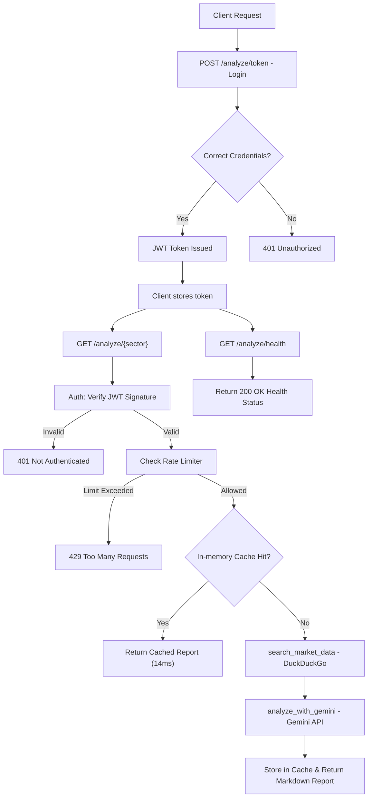

# Trade Opportunities API 🚀📈

A production-grade FastAPI service designed to provide real-time, AI-driven investment insights into various Indian market sectors. This project implements industry-standard security patterns, highly optimized caching, and custom rate limiting.

---

## 📋 Table of Contents

- [1. INTRODUCTION](#1-introduction)
- [2. Detailed Implementation](#2-detailed-implementation)
    - [Application Flow Diagram](#application-flow-diagram)
    - [Technical Breakdown](#technical-breakdown)
    - [Security Summary Table](#security-summary-table)
- [3. Setup & Installation](#3-setup--installation)
- [4. API Specification & Usage](#4-api-specification--usage)
- [5. Output & Implementation Screenshots](#5-output--implementation-screenshots)
- [6. Project Structure](#6-project-structure)

---

## 1. INTRODUCTION

Hi Team, I have implemented a professional, high-performance FastAPI application for market analysis reports as per the specified requirements. This service combines real-time data scraping with Generative AI to provide actionable investment reports.

This version moves beyond a simple script, implementing **JWT-based authentication**, **sliding-window rate limiting**, and **in-memory TTL caching** to ensure the service is production-ready and protects against AI quota exhaustion.

---

## 2. Detailed Implementation

### Application Flow Diagram

The following diagram illustrates the lifecycle of a request, from authentication to the final AI-generated report:



### Technical Breakdown

#### **Backend Framework (FastAPI)**
- **How it works**: Provides the core asynchronous engine. It handles routing, automatic Pydantic validation, and dependency injection for security layers.

#### **Security & Authentication (JWT)**
- **Library**: `PyJWT`, `passlib[bcrypt]`
- **How it works**: Uses stateless **JSON Web Tokens (JWT)**. On login, the server issues a signed token. Protected endpoints verify this signature using a secret key. Passwords are never stored in plain text.

#### **Performance & Caching**
- **Library**: `cachetools (TTLCache)`
- **How it works**: To ensure extreme speed and protect Gemini's API quota, we implement an in-memory sliding cache. Repeated requests for the same sector return in **~14ms**.

#### **Rate Limiting (Custom)**
- **Implementation**: Sliding Window algorithm.
- **How it works**: Tracks request timestamps per user. Exceeding 5 requests/min triggers a `429` status with `Retry-After` headers.

---

### Security Summary Table

| Feature | Library / Model | How it Works (Short) |
| :--- | :--- | :--- |
| **Authentication** | `PyJWT`, `passlib` | Stateless JWT tokens + password hashing |
| **Rate Limiting** | Custom Logic | Sliding window, per-IP, in-memory |
| **LLM (AI)** | `google-generativeai` | Gemini AI for report generation |
| **Web Search** | `duckduckgo-search` | Scrape real-time market trends |
| **Caching** | `cachetools` | 5-min TTL cache for instant responses |

---

## 3. Setup & Installation

1. **Clone the repository**:
   ```bash
   git clone https://github.com/DsThakurRawat/Appscrip.git
   cd Appscrip
   ```

2. **Create and activate a virtual environment**:
   ```bash
   python3 -m venv venv
   source venv/bin/activate
   ```

3. **Install dependencies**:
   ```bash
   pip install -r requirements.txt
   ```

4. **Configure Environment**:
   Create a `.env` file:
   ```env
   GEMINI_API_KEY=your_gemini_api_key_here
   SECRET_KEY=your_jwt_secret_key_here
   ```

---

## 4. API Specification & Usage

### **1. Access Token Generation**
- **Endpoint**: `POST /analyze/token`
- **Description**: Authenticate and receive a Bearer token.
- **Request Body**: (Form Data)
  - `username`: guest_user
  - `password`: password123
- **Example Response**:
```json
{
  "access_token": "eyJhbGciOiJIUzI1NiIsInR5cCI6IkpXVCJ9...",
  "token_type": "bearer"
}
```

### **2. Sector Analysis Endpoint**
- **Endpoint**: `GET /analyze/{sector}`
- **Description**: Main endpoint to analyze a sector. Requires Authentication.
- **Rate Limit**: 5 requests per minute.
- **Parameters**: 
  - `sector` (path): Industry sector name (e.g., `technology`, `healthcare`)
- **Example Response**:
```json
{
  "sector": "technology",
  "summary": "The Indian tech sector is seeing strong growth...",
  "opportunities": [
    {
      "title": "Digital Transformation",
      "potential": "High"
    }
  ]
}
```

### **3. Health Check**
- **Endpoint**: `GET /analyze/health`
- **Description**: Verify service availability.
- **Example Response**:
```json
{
  "status": "healthy",
  "version": "1.0.0"
}
```

---

## 5. Output & Implementation Screenshots

### **Swagger API Documentation**
The API includes interactive documentation where you can test the JWT flow directly.


### **Sector Analysis Report**
Example of a professional, AI-generated Indian market report for the 'Technology' sector.


---

## 6. Project Structure

- `app/main.py`: Entry point with CORS and Router initialization.
- `app/api/`: Endpoint definitions and request/response handling.
- `app/core/`: Security (JWT), Config management, and Rate Limiting.
- `app/services/`: Business logic (Market Scraper & AI Analysis).
- `app/models/`: Pydantic schemas for data validation.
