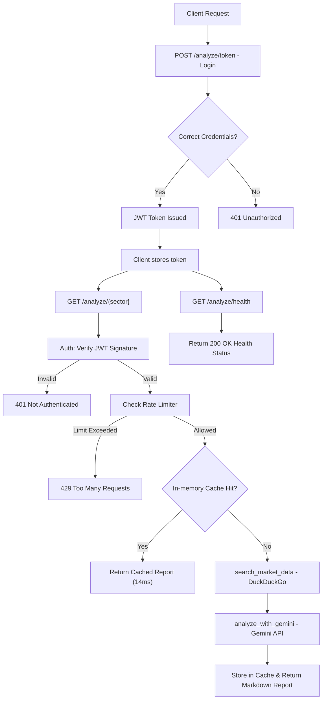

# Trade Opportunities API

A production-grade FastAPI service designed to provide real-time, AI-driven investment insights into various Indian market sectors. This project implements industry-standard security patterns, highly optimized caching, and custom rate limiting.

---

## Table of Contents

- [INTRODUCTION](#introduction)
- [Professional Implementation](#professional-implementation)
  - [Application Flow Diagram](#application-flow-diagram)
  - [To Run the Application Locally:](#to-run-the-application-locally)
    - [Prerequisites](#prerequisites)
    - [Setup Steps](#setup-steps)
  - [Technical Deep-Dive](#technical-deep-dive)
    - [Backend Framework](#backend-framework)
    - [Session Management](#session-management)
    - [Rate Limiting](#rate-limiting)
    - [Security Best Practices](#security-best-practices)
  - [API Specification](#api-specification)
  - [Summary Table](#summary-table)
- [Output & Implementation Screenshots](#output--implementation-screenshots)
  - [Access Token Generation](#access-token-generation)
  - [Authorization Flow](#authorization-flow)
  - [Sector Analysis Endpoint](#sector-analysis-endpoint)
  - [Health Check Monitoring](#health-check-monitoring)
- [Project Structure](#project-structure)

---

## INTRODUCTION

Hi Team, I have implemented a professional, high-performance FastAPI application for market analysis reports as per the specified requirements. This service combines real-time data scraping with Generative AI to provide actionable investment reports.

### 🌐 Quick Links
- **Interactive API Docs (Swagger)**: [http://127.0.0.1:8000/docs](http://127.0.0.1:8000/docs)
- **Alternative API Docs (ReDoc)**: [http://127.0.0.1:8000/redoc](http://127.0.0.1:8000/redoc)

This version moves beyond a simple script, implementing **JWT-based authentication**, **sliding-window rate limiting**, and **in-memory TTL caching** to ensure the service is production-ready and protects against AI quota exhaustion.

---

## Professional Implementation

### Application Flow Diagram

The following diagram illustrates the lifecycle of a request, from authentication to the final AI-generated report:



### To Run the Application Locally

#### Prerequisites

- **Python 3.10+**
- **Git**
- **Google Gemini API Key**

#### Setup Steps

1. **Clone and Navigate**:

   ```bash
   git clone https://github.com/DsThakurRawat/Appscrip.git
   cd Appscrip
   ```

2. **Virtual Environment**:

   ```bash
   python3 -m venv venv
   source venv/bin/activate
   ```

3. **Install dependencies**:

   ```bash
   pip install -r requirements.txt
   ```

4. **Environment Variables**:
   Create a `.env` file in the root:

   ```env
   GEMINI_API_KEY=your_gemini_api_key_here
   SECRET_KEY=your_jwt_secret_key_here
   ```

5. **Start the server**:

   ```bash
   uvicorn app.main:app --reload
   ```

---

### Technical Deep-Dive

#### **Backend Framework**

- **FastAPI**
  - **Library**: `fastapi`
  - **How it works**: Provides the main API framework, routing, dependency injection, and async support. The app is created with `FastAPI()` and endpoints are defined using decorators like `@app.get()` and `@app.post()`.

#### **Session Management**

- **In-memory session tracking**
  - **How it works**: User sessions are tracked using JWT tokens (stateless) and in-memory Python dictionaries for rate limiting and user data. No external session store is used.

#### **Rate Limiting**

- **Custom in-memory rate limiter**
  - **How it works**:
    - Uses a `defaultdict(list)` to store timestamps of user requests.
    - Checks the number of requests in a sliding window (e.g., 5 requests per 60 seconds).
    - Raises HTTP 429 if the limit is exceeded.
  - **Location**: `check_rate_limit()` function.

#### **Security Best Practices**

- **Password Hashing**:
  - **Library**: `passlib` (with `bcrypt`)
  - **How it works**: Passwords are hashed and verified securely using industry-standard algorithms.
- **JWT Authentication**:
  - **Libraries**: `PyJWT`
  - **How it works**: JWT tokens are issued on login and required for protected endpoints.
- **Error Handling**:
  - **How it works**: Uses FastAPI's `HTTPException` for clear, descriptive error responses.

---

### API Specification

- **Single Endpoint**:
  - **GET /analyze/{sector}**
  - **How it works**:
    - Accepts a sector name, collects data, analyzes it with Gemini, and returns a markdown report.
    - Requires authentication and is rate-limited.

#### **Summary Table**

| Feature | Library / Model | How it Works (Short) |
| :--- | :--- | :--- |
| **FastAPI** | `fastapi` | Main API framework |
| **Session Management** | `JWT, in-memory dict` | JWT tokens + in-memory tracking |
| **Rate Limiting** | `Python dict, FastAPI` | Sliding window, per-user, in-memory |
| **Security Best Practices** | `passlib, PyJWT` | Hashed passwords, JWT, error handling |
| **Input Validation** | `pydantic, FastAPI` | Typed models, parameter checks |
| **LLM (AI)** | `google-generativeai` | Market analysis via prompt to Gemini |
| **Web Search** | `duckduckgo-search` | Fetches sector news/data |
| **Storage** | `In-memory dicts` | No database, all in RAM |
| **Authentication** | `fastapi.security, passlib` | JWT, hashed passwords |

---

### Input/output Validation or type checking

```python
@app.get("/analyze/{sector}", response_model=MarketReport)
async def analyze_sector(
    sector: str = Path(..., min_length=3, regex="^[a-zA-Z ]+$"),
    payload: dict = Depends(verify_jwt),
    _rate_limit: None = Depends(check_rate_limit)
):
    # 1. Validation Logic (performed by FastAPI/Pydantic)
    # 2. Data Collection
    # 3. AI Analysis
    ...

class Token(BaseModel):
    access_token: str
    token_type: str

class User(BaseModel):
    username: str
```

---

## Output & Implementation Screenshots

### Access Token Generation

The login endpoint handles credential verification and issues the bearer token.


### Authorization Flow

Securely authorized requests using the `Authorization: Bearer <token>` header pattern.


### Sector Analysis Endpoint

Real-world output of the AI-generated sector analysis report.


### Health Check Monitoring

Dedicated endpoint for infrastructure monitoring and deployment readiness.


---

## Project Structure

- `app/main.py`: Entry point with CORS and Router initialization.
- `app/api/`: Endpoint definitions and request/response handling.
- `app/core/`: Security (JWT), Config management, and Rate Limiting.
- `app/services/`: Business logic (Market Scraper & AI Analysis).
- `app/models/`: Pydantic schemas for data validation.
