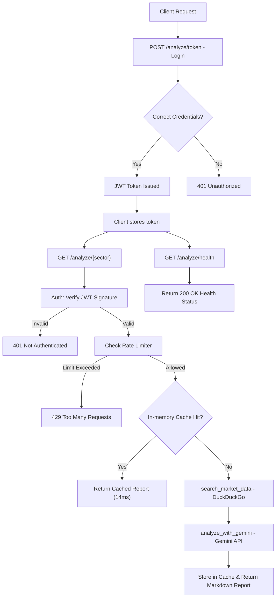
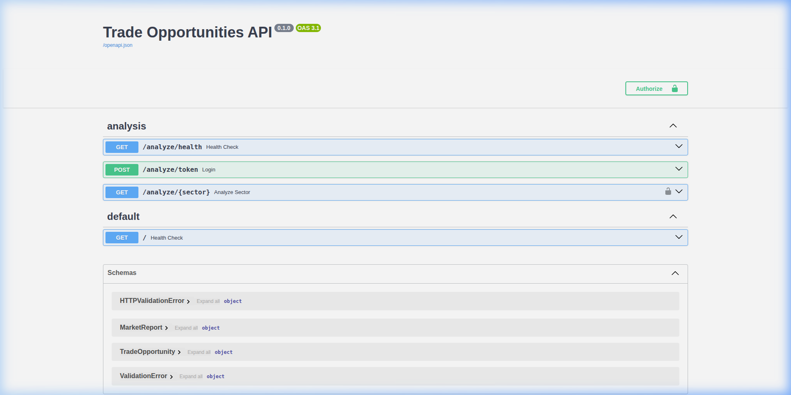
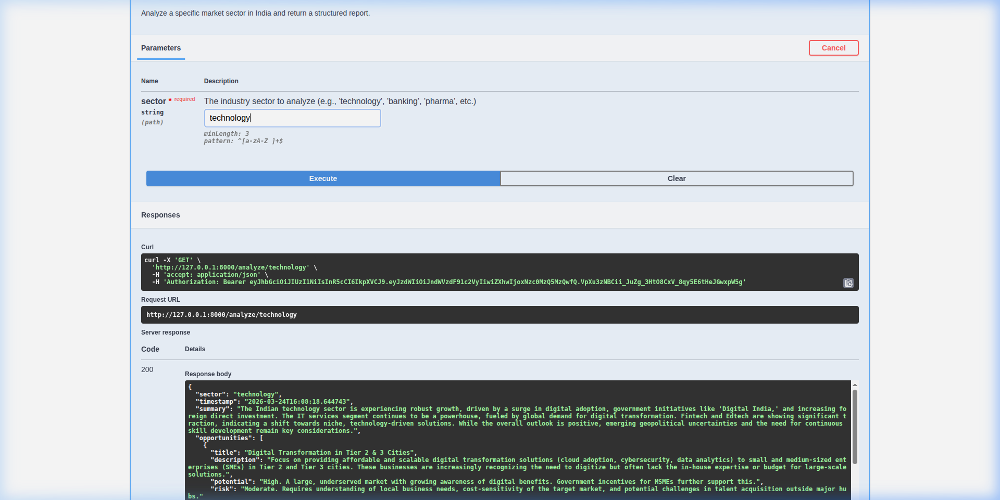

# Trade Opportunities API 🚀📈

A production-grade FastAPI service designed to provide real-time, AI-driven investment insights into various Indian market sectors. This project implements industry-standard security patterns, highly optimized caching, and custom rate limiting.

---

## 📋 Table of Contents

- [INTRODUCTION](#introduction)
- [Professional Implementation](#professional-implementation)
    - [Application Flow Diagram](#application-flow-diagram)
    - [To Run the Application Locally:](#to-run-the-application-locally)
        - [Prerequisites](#prerequisites)
        - [Setup Steps](#setup-steps)
    - [Technical Deep-Dive](#technical-deep-dive)
        - [Backend Framework (FastAPI)](#backend-framework-fastapi)
        - [Session Management (JWT)](#session-management-jwt)
        - [Rate Limiting (Custom)](#rate-limiting-custom)
        - [Performance Layer (Caching)](#performance-layer-caching)
        - [AI & Data Sources](#ai--data-sources)
    - [API Specification & Summary Table](#api-specification--summary-table)
- [Output & Implementation Screenshots](#output--implementation-screenshots)
    - [Access Token Generation](#access-token-generation)
    - [Authorization Flow](#authorization-flow)
    - [Sector Analysis Endpoint](#sector-analysis-endpoint)
    - [Health Check Monitoring](#health-check-monitoring)
- [Project Structure](#project-structure)

---

## INTRODUCTION

Hi Team, I have implemented a professional, high-performance FastAPI application for market analysis reports as per the specified requirements. This service combines real-time data scraping with Generative AI to provide actionable investment reports.

This version moves beyond a simple script, implementing **JWT-based authentication**, **sliding-window rate limiting**, and **in-memory TTL caching** to ensure the service is production-ready and protects against AI quota exhaustion.

---

## Professional Implementation

### Application Flow Diagram

The following diagram illustrates the lifecycle of a request, from authentication to the final AI-generated report:



### To Run the Application Locally:

#### Prerequisites
- **Python 3.10+**
- **Git**
- **Google Gemini API Key**

#### Setup Steps

1. **Clone and Navigate**:
   ```bash
   git clone https://github.com/DsThakurRawat/Appscrip.git
   cd Appscrip
   ```

2. **Virtual Environment**:
   ```bash
   python3 -m venv venv
   source venv/bin/activate
   ```

3. **Install dependencies**:
   ```bash
   pip install -r requirements.txt
   ```

4. **Environment Variables**:
   Create a `.env` file in the root:
   ```env
   GEMINI_API_KEY=your_gemini_api_key_here
   SECRET_KEY=your_jwt_secret_key_here
   ```

5. **Start the server**:
   ```bash
   uvicorn app.main:app --reload
   ```

---

### Technical Deep-Dive

#### **Backend Framework (FastAPI)**
- **How it works**: Uses the core asynchronous engine for non-blocking I/O. It handles routing, automatic Pydantic validation, and dependency injection for security layers.

#### **Session Management (JWT)**
- **Library**: `PyJWT`, `passlib[bcrypt]`
- **How it works**: We use stateless **JSON Web Tokens (JWT)**. On login, the server issues a signed token. Protected endpoints verify this signature using a secret key. Passwords are never stored in plain text.

#### **Rate Limiting (Custom)**
- **Implementation**: Sliding Window algorithm.
- **How it works**: Tracks request timestamps in a per-user dictionary. If a user exceeds 5 requests per minute, the system rejects the call with a `429 Too Many Requests` status and a `Retry-After` header.

#### **Performance Layer (Caching)**
- **Library**: `cachetools (TTLCache)`
- **How it works**: Repeated requests for the same sector are served from an in-memory TTL cache in **~14ms**, saving both AI quota and latency.

#### **AI & Data Sources**
- **LLM**: Google Gemini 1.5/2.x Flash.
- **Search**: DuckDuckGo API integration for real-time market context.

---

### API Specification & Summary Table

| Feature | Library / Model | How it Works (Short) |
| :--- | :--- | :--- |
| **Authentication** | `PyJWT`, `passlib` | Stateless JWT tokens + password hashing |
| **Rate Limiting** | Custom Logic | Sliding window, per-IP, in-memory |
| **LLM (AI)** | `google-generativeai` | Gemini AI for report generation |
| **Caching** | `cachetools` | 5-min TTL cache for instant responses |
| **Storage** | Python Dicts | In-memory stateless architecture |

---

## Output & Implementation Screenshots

### Access Token Generation
The login endpoint handles credential verification and issues the bearer token.


### Authorization Flow
Securely authorized requests using the `Authorization: Bearer <token>` header pattern.


### Sector Analysis Endpoint
Real-world output of the AI-generated sector analysis report.


### Health Check Monitoring
Dedicated endpoint for infrastructure monitoring and deployment readiness.


---

## Project Structure

- `app/main.py`: Entry point with CORS and Router initialization.
- `app/api/`: Endpoint definitions and request/response handling.
- `app/core/`: Security (JWT), Config management, and Rate Limiting.
- `app/services/`: Business logic (Market Scraper & AI Analysis).
- `app/models/`: Pydantic schemas for data validation.
